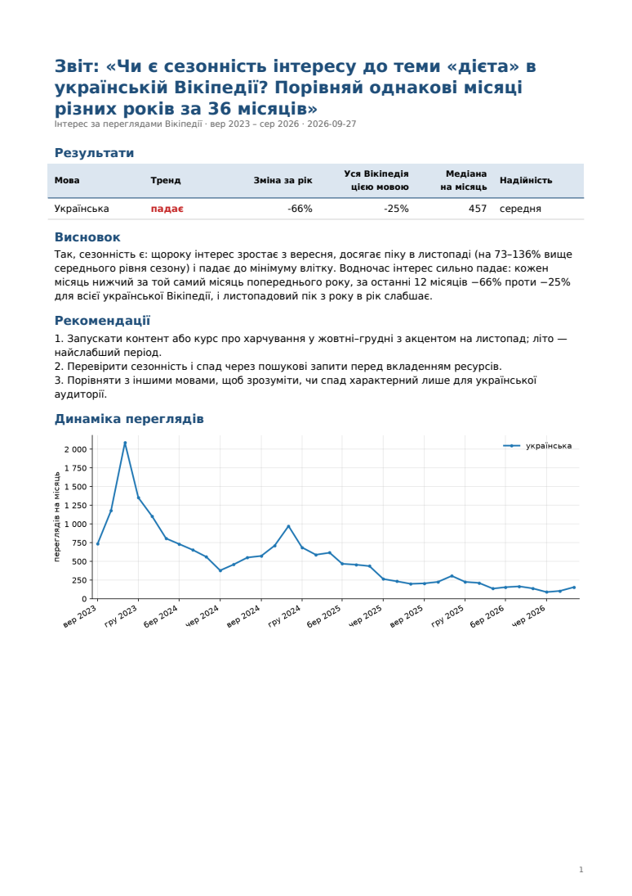
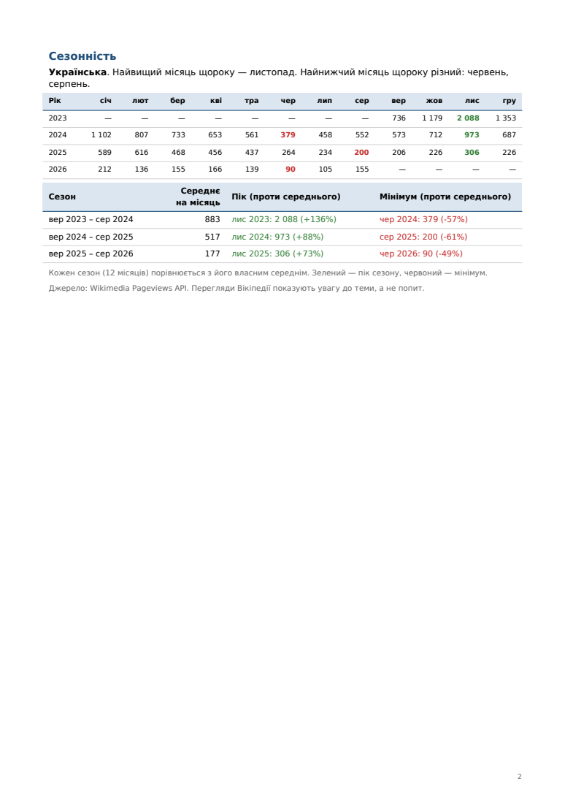
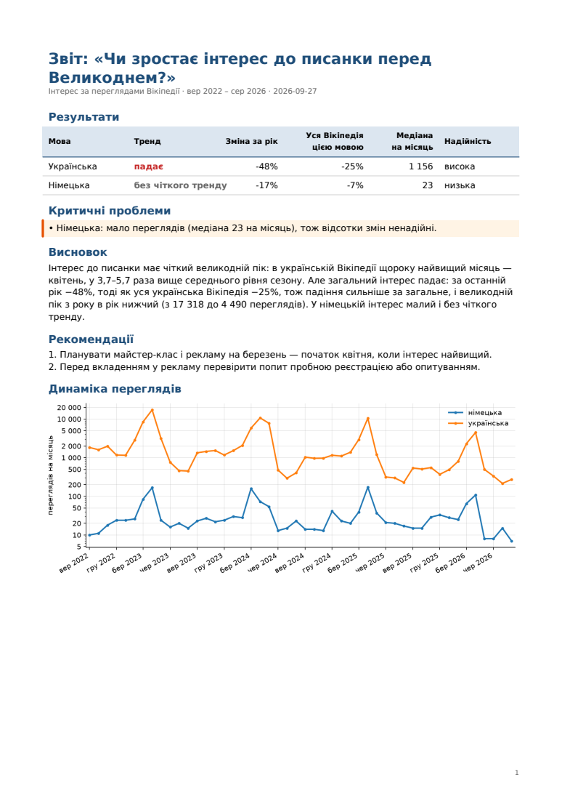
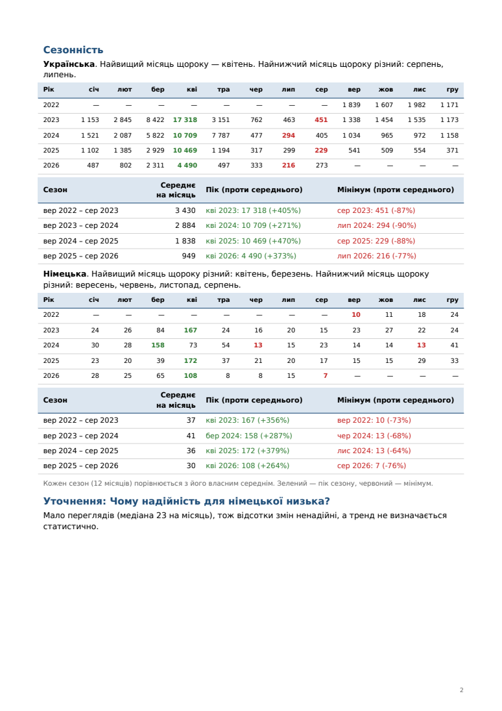
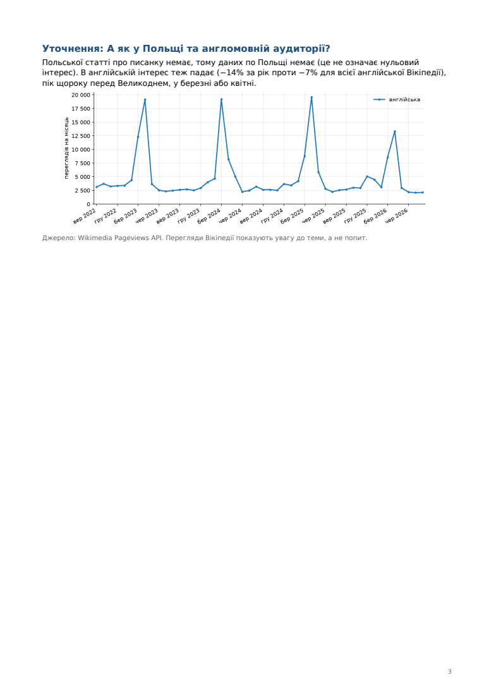

# wiki-interest-analyzer-skill

A Claude Code [Agent Skill](https://docs.claude.com/en/docs/claude-code/skills) that measures
how public interest in a topic changes over time and across languages, using Wikipedia
pageviews as a proxy.

Everything (code, docs, tests, evals) lives in the skill directory:
[`.claude/skills/wiki-interest/`](.claude/skills/wiki-interest/SKILL.md).

## Requirements

- [uv](https://docs.astral.sh/uv/) (installs Python 3.12 and the locked dependencies itself)
- Internet access to `wikimedia.org` / `wikidata.org`

## Use it in Claude Code

Open this repository in Claude Code. The skill is picked up automatically from
`.claude/skills/`. Ask e.g. "How has interest in astronomy changed in Ukrainian, Polish
and Czech Wikipedia?" or call it explicitly with `/wiki-interest`.

To use it in other projects, copy the folder to `~/.claude/skills/wiki-interest/`.

## Run it manually

```bash
uv run --directory .claude/skills/wiki-interest wiki-interest run "Astronomy" --langs uk,pl,cs --months 24 \
  --lang uk --question "Is interest in astronomy growing?"

uv run --directory .claude/skills/wiki-interest wiki-interest run --session <session_id> --langs de,en \
  --question "And in German and English?"

uv run --directory .claude/skills/wiki-interest wiki-interest report --session <session_id> --lang uk \
  --title "Is interest in astronomy growing?" --conclusion "..." --recommendation "..." \
  --followup 2 "<short answer to step 2>" --followup "<question answered in chat>" "<short answer>"
```

Results are written to `.claude/skills/wiki-interest/runs/<session_id>/`: `session.json`,
`analysis-<step>.json` and `chart-<step>.png` for every step, and one `report.pdf`.

## Example reports

Real reports generated by the skill (Ukrainian, data up to August 2026). Click a page to open the PDF.

### 1. Single question

"Is there seasonality in interest in «diet» on Ukrainian Wikipedia? Compare the same months
of different years over 36 months." Results table, conclusion, recommendations, chart, and
the seasonality section: month × year table and each season's peak and low vs its average.

<p>
  <a href=".claude/skills/wiki-interest/examples/report-single-question.pdf"></a>
  <a href=".claude/skills/wiki-interest/examples/report-single-question.pdf"></a>
</p>

### 2. With follow-up questions

Main: "Is interest in pysanka growing before Easter?" (uk, de, 48 months). Follow-up 1:
"Why is reliability low for German?" (answered from existing data). Follow-up 2: "What about
Poland and the English-speaking audience?" (new data: its own chart, no Polish article).

<p>
  <a href=".claude/skills/wiki-interest/examples/report-with-followups.pdf"></a>
  <a href=".claude/skills/wiki-interest/examples/report-with-followups.pdf"></a>
  <a href=".claude/skills/wiki-interest/examples/report-with-followups.pdf"></a>
</p>

## Tests

```bash
cd .claude/skills/wiki-interest
uv sync --locked
uv run pytest
```
